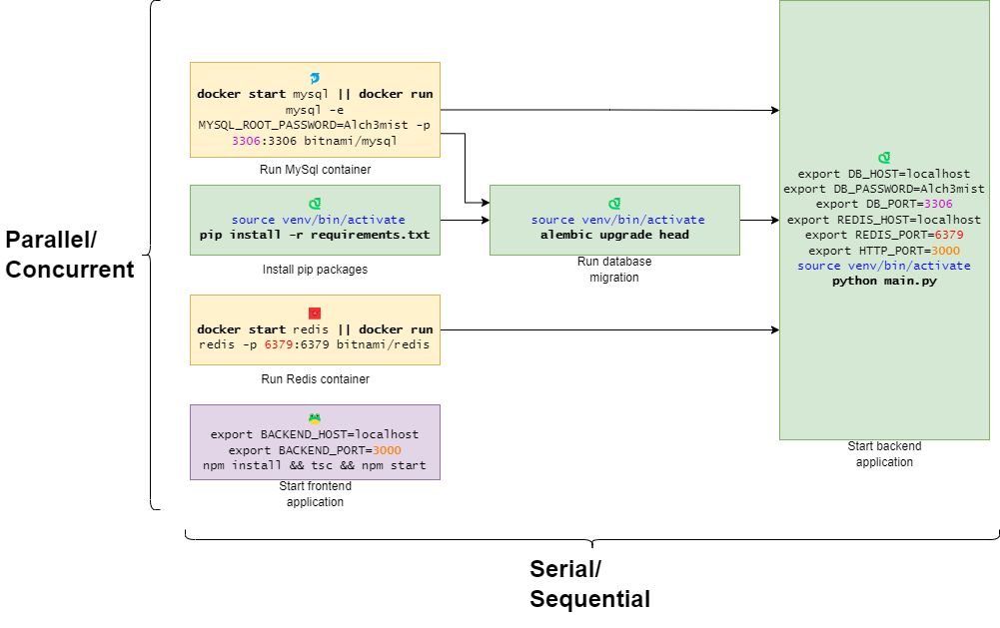
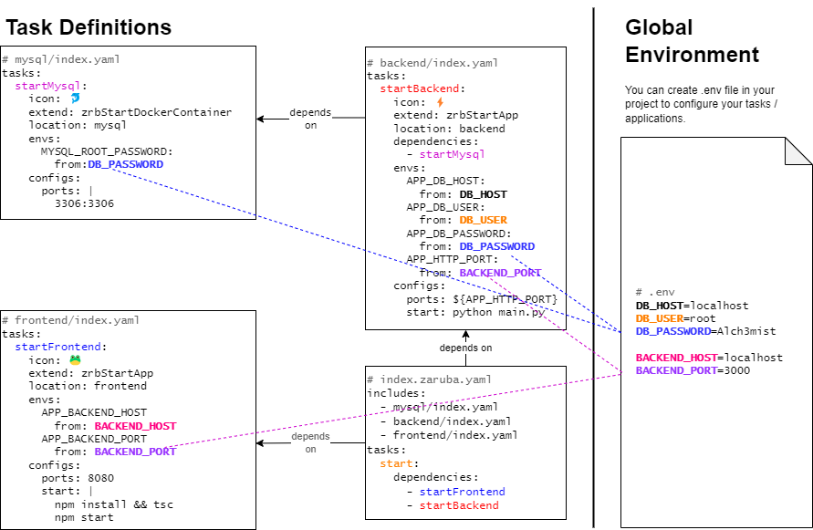

[Documentation](docs/README.md) | [Tutorial](docs/use-cases/from-zero-to-cloud.md) | [Installation](#-installation)

> ⚠️ Things might change pretty fast and pretty often before we reach `v.1.0.0`. Please open [an issue](https://github.com/state-alchemists/zaruba/issues) if you find any problem using Zaruba.

# 💀 Zaruba 

Zaruba is a [task](docs/core-concepts/task/README.md) runner and [CLI utility](docs/utilities/README.md). It helps you __prepare__, __run__, __deploy__, and __debug__ your applications.

## ❓ Problem

Developing/debugging a system can be challenging. 

Your system might consist of several applications that depend on each other. And you need to watch every message or error log in your applications. So, you might end up opening many tmux panels.

Suppose your system consists of:
- A __frontend__ application
- A __backend__ application
- __MySQL__
- __Redis__

You will need to run the following tasks __every time__:



You can see that:

- ⛓️ Several tasks are better __running in parallel__ (i.e., the four most left tasks).
- 🔗 Several tasks have __dependencies__. For example:
  - To run database migration, you have to `Run the MySQL container` and `Install pip packages` first.
  - To start your backend application, you have to run database migration.
- 📐 Several tasks might __share similar behavior__. For example:
  - Running MySQL/Redis container is pretty much the same:
    - First, you need to start the container.
    - If the container is not there, you need to create and start it.
  - To execute any Python-related tasks, you have to activate the virtual environment first.
- ⚙️ Several tasks might __share a similar configuration__. For example:
  - `BACKEND_PORT` in your frontend has to reflect `HTTP_PORT` in your backend.
  - `DB_PASSWORD` in your backend has to reflect `MYSQL_ROOT_PASSWORD` in your MySQL container.

Thus, you have to be careful when you want to run the system on your computer. You must ensure the configuration is correct and the tasks executed in order.

Now, how to run your system with a __single command__? How do we __ensure task dependencies__? How to ensure that the __task configurations are in sync__ with each other? 

## 💡 Solution

Instead of opening many tmux panels, Zaruba allows you to create and run __a single task to run your entire system__.


In Zaruba, you can think of [tasks](docs/core-concepts/task/README.md) as [DAG](https://en.wikipedia.org/wiki/Directed_acyclic_graph). __A task can have many [dependencies](docs/core-concepts/task/define-task-dependencies.md)__. And Zaruba will always run the dependencies first before running your tasks.

Zaruba also lets you __link [task environments](docs/core-concepts/task/task-envs/README.md) to system environments__. This allows you to configure your applications as a single system.

Let's see the following example:



First, Zaruba allows you to __set task dependencies__ using `dependencies` keyword:
- `start` depends on `startFrontend` and `startBackend`.
- `startBackend` depends on `startMysql`.

Zaruba also allows you to __share environment values__ among your tasks:
- `startMysql.envs.MYSQL_ROOT_PASSWORD` and `startBackend.envs.DB_PASSWORD` shared the same value (i.e., `DB_PASSWORD=Alch3mist`).
- `startFrontend.envs.BACKEND_PORT` and `startBackend.envs.APP_HTTP_PORT` shared the same value (i.e., `BACKEND_PORT=3000`).

More importantly, Zaruba allows you to __start your tasks__ by invoking a __single command__:

```bash
zaruba please start
```

## 🔍 Tutorial

You can visit the [end-to-end tutorials](docs/use-cases/from-zero-to-cloud.md) to see:

- How to make a working [microservices-ready monolith](https://github.com/state-alchemists/amalgam/blob/master/myProject/myApp/_docs/motivation-and-architecture/README.md).
- How to create CRUD features and web pages
- How to run everything on your 🖥️ local computer (as monolith or microservices).
- How to run everything on your local computer as 🐳 containers (as monolith or microservices).
- How to deploy everything on your ☸️ Kubernetes cluster.

## 💡 Similar Projects/Solutions

Zaruba is focusing on helping you to write/generate/run your applications. Some of those goals are overlapped with other tools. Zaruba __is not a replacement__ for those tools.

- [Shell script](https://www.shellscript.sh/): Shell script can help you to run multiple tasks sequentially. You can also use background processes to execute many tasks at once. Shell script supports control logic like branch and loop. You can think of Zaruba as a declarative framework to manage your shell scripts.
- [Tmux](https://github.com/tmux/tmux): Tmux allows you to open multiple terminals at once. Thus it also supports parallelism. Unlike tmux, Zaruba runs your processes at a single panel.
- [Screen](https://www.gnu.org/software/screen/): Screen is similar to tmux in so many ways.
- [Docker Compose](https://docs.docker.com/compose/): Docker Compose supports parallelism. If you can define your tasks as Docker containers, Docker Compose is a good alternative to Zaruba. But, unlike Docker Compose, Zaruba also supports local processes.
- [Ansible](https://www.ansible.com/): Ansible is an automation platform. Ansible focuses on managing your servers, while Zaruba focuses on helping you to run/debug your applications. With Zaruba, you can choose to use DBMS/messaging system in the cloud or locally. Some Zaruba tasks have `runInLocal` config that you can manage easily.
- [Telemetry](https://www.telepresence.io/): If you deployed your application in the Kubernetes cluster, telemetry is a good alternative to Zaruba. Telemetry allows you to run some of your services locally. This is very useful for debugging, similar to `runInLocal` config on Zaruba. Unlike telemetry, Zaruba is also able to help you generate deployment/deploy your application.

# 👨‍💻 Installation

<details>
<summary><bold>TL;DR</bold></summary>

```bash
sudo apt-get install golang wget curl git
sh -c "$(curl -fsSL https://raw.githubusercontent.com/state-alchemists/zaruba/master/install.sh)"
zaruba install ubuntu-essentials
zaruba install docker
zaruba install kubectl
zaruba install helm
zaruba install pulumi
```

Visit the [getting started section](#-getting-started).

</details>

## 📖 From Source

Installing from source is the best way to set up Zaruba for day-to-day use.

We don't plan to create [APT](https://en.wikipedia.org/wiki/APT_(software)) or platform-specific packages for Zaruba. If you are using windows, you need to install [WSL](https://docs.microsoft.com/en-us/windows/wsl/install) to get started.

### 🧅 Prerequisites

Before installing Zaruba from the source, you need to install some prerequisites:

* `go 1.13` or newer (To install `go`, you can visit its [official website](https://golang.org/doc/install))
* `wget` or `curl`
* `git`

> __💡 HINT__ If you are using Ubuntu, you can install all prerequisites by invoking: `sudo apt-get install golang wget curl git`.

### 🥗 Installing From Source

To install Zaruba using __curl__, you can do the following:

```bash
sh -c "$(curl -fsSL https://raw.githubusercontent.com/state-alchemists/zaruba/master/install.sh)"
```

To install Zaruba using __wget__, you can do the following:

 ```bash
sh -c "$(wget -O- https://raw.githubusercontent.com/state-alchemists/zaruba/master/install.sh)"
```

## 🐳 Using Docker

Using docker is the quickest way to install Zaruba, especially if you need to use Zaruba in your CI/CD.

To create and run a Zaruba container on a __🐧Linux__ host, you can do the following:

```bash
docker run -d --name zaruba --network host \
  -v "$(pwd):/project" \
  -e "ZARUBA_HOST_DOCKER_INTERNAL=172.17.0.1" \
  -e "DOCKER_HOST=tcp://172.17.0.1:2375" \
  stalchmst/zaruba:latest
```

To create and run a Zaruba container on a __🪟 Windows__/__🍎 Mac__ host, you can do the following:

```bash
docker run -d --name zaruba \
  -p 8500-8700:8500-8700 \
  -v "$(pwd):/project" \
  stalchmst/zaruba:latest
```

For more information about Zaruba's docker image, please visit [docker hub](https://hub.docker.com/repository/docker/stalchmst/zaruba).

> __⚠️ NOTE__ There will be some limitations if you run Zaruba container in `docker-desktop`. For example, docker-desktop doesn't support host networking. Thus, you need to expose the ports by yourself. (e.g., `docker run -d --name zaruba -p 8200-8300:8200-8300 -v "$(pwd):/project" stalchmst/zaruba:latest`)

# 📜 Getting Started

To get started, you can:

* [📖 Browse the documentation](docs/README.md),
* [❇️ Follow end to end tutorials](docs/use-cases/from-zero-to-cloud.md), and
* [🧠 Learn the core concept](docs/core-concepts/README.md)

# ➕ Extra Prerequisites

Some tasks need `docker`, `kubectl`, `helm`, and `pulumi` installed. You can invoke the following command to install those extra prerequisites: 

```bash
zaruba install <extra-prerequisite>
```

To see whether you need to install extra prerequisites or not, you can use this guide:

* You need [docker](https://www.docker.com/get-started) to build, pull or push images. You also need docker if you want to run your applications as containers.
* You need [kubectl](https://kubernetes.io/docs/home/#learn-how-to-use-kubernetes) to access your Kubernetes cluster.
* You need [helm](https://helm.sh/) and [pulumi](https://www.pulumi.com/) to deploy your applications into a Kubernetes cluster.
* You need [tocer](https://github.com/state-alchemists/tocer) to scaffold Zaruba's documentation.
* You need [pyenv](https://github.com/pyenv/pyenv) to run many `Python` versions.
* You need [nvm](https://github.com/nvm-sh/nvm) to run many `Node.Js` versions.

To install all extra prerequisites, please perform:

```bash
zaruba install docker
zaruba install kubectl
zaruba install helm
zaruba install pulumi
zaruba install pyenv
zaruba install nvm
```

# 🐞 Bug Report, Feature Request, and Contribution

You can always open an [issue](https://github.com/state-alchemists/zaruba/issues) or a [pull request](https://github.com/state-alchemists/zaruba/pulls).

When opening a pull request, please write down:

* Zaruba version you used.
* Your expectation/goal.
* Things you have tried to achieve the goal.
* The result you get.

> __💡 HINT__ You can get the zaruba version invoking: `zaruba version`.

# ☑️ Testing

To perform the test, you need to have:

* docker desktop
* kubectl
* helm
* pulumi
* go 1.13
* make

Once you meet all the prerequisites, you can perform:

```bash
make test
```

# ☕ Donation

Help Red Skull to click the donation button:

[](https://stalchmst.com/donation.html)

# 🎉 Fun fact

> Madou Ring Zaruba (魔導輪ザルバ, Madōrin Zaruba) is a Madougu which supports bearers of the Garo Armor. [(Garo Wiki | Fandom)](https://garoseries.fandom.com/wiki/Zaruba)


