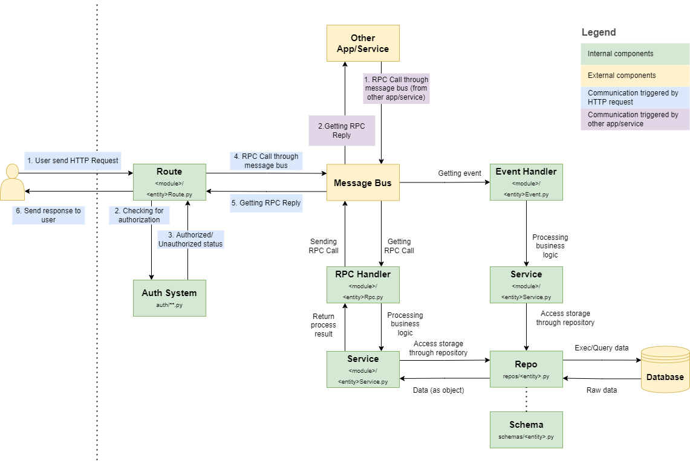

# ZtplAppDirectory

An opinionated Fast API application. Built with ❤️ based on past mistakes/experiences.

# How to run

```bash
# create virtual environment if not exist
if [ ! -d ./venv ]; then python -m venv ./venv; fi

# activate virtual environment
source venv/bin/activate

# install pip packages
pip install -r requirements.txt

# load environments
source template.env

# run the application
./start.sh
```

# Application structure

```
.
├── Dockerfile
├── README.md
├── 🔑 auth                      # Authentication + Authorization module
│   ├── __init__.py
│   ├── event.py                  # Auth's event handler
│   ├── route.py
│   ├── rpc.py
│   ├── authModel.py              # Auth model
│   ├── roleModel.py
│   ├── roleRoute.py
│   ├── roleRpc.py
│   ├── tokenModel.py
│   ├── userModel.py
│   ├── userRoute.py
│   ├── userRpc.py
│   └── userSeederModel.py
├── database.db
├── 🧰 helpers
│   ├── __init__.py
│   ├── app                       # App configuration halpers
│   └── transport                 # Messagebus and RPC helpers
├── <⚙️ module>                  # Module (domain)
│   ├── __init__.py
│   ├── event.py                  # Module's event handler
│   ├── route.py                  # Module's route handler
│   ├── rpc.py                    # Module's rpd handler
│   ├── <⚙️ crud-model>.py       # CRUD model (business logic layer)
│   ├── <⚙️ crud-route>.py       # CRUD route (delivery layer)
│   └── <⚙️ crud-rpc>.py         # CRUD RPC layer (connecting route and model)
├── main.py                       # App bootstrap
├── 🛢️ repos
│   ├── __init__.py
│   ├── <⚙️ crud-repo>.py        # CRUD repo interface (datastore layer)
│   ├── <⚙️ db-crud-repo>.py     # CRUD repo implementation (datastore layer)
│   ├── dbRole.py
│   ├── dbUser.py
│   ├── role.py
│   └── user.py
├── requirements.txt
├── 📋 schemas
│   ├── __init__.py
│   ├── <⚙️ crud-schema>.py      # Data structure (DTO)
│   ├── role.py
│   └── user.py
├── start.sh
└── template.env
```

# Components interaction



## Route handlers

Route handlers handle HTTP routes from users/other apps. It needs to talk to `Auth system` to authenticate/authorize the request.

Once the request has been authenticated/authorized, the route handler can do some pre-processing before firing an `event` or calling a `RPC`.

If you expect an immediate response, you should use `rpc`, but if you just want to fire an event and forget, you should use `mb` instead.

See these example:

```python

def register_ml_route_handler(app: FastAPI, mb: MessageBus, rpc: RPC, auth_model: AuthModel):

    @app.get('/train-model', response_class=HTMLResponse)
    def get_(current_user = Depends(auth_model.everyone())) -> HTMLResponse:
        # invoking train_model
        mb.call('train_model')
        # immediately return response without waiting for train_model event to be processed.
        return HTMLResponse(content='train model has been invoked', status_code=200)

    @app.get('/predict-data', response_class=float)
    def get_(current_user = Depends(auth_model.everyone()), data: List[float]) -> HTMLResponse:
        # have to get the prediction result before returning response.
        prediction = rpc.call('predict_data', data)
        return prediction

    print('Register ml route handler')
```

> __Note:__ don't worry, we have local RPC/messagebus as well, so you don't really need to install third party message bus unless necessary.

## Auth system
## Event handlers

> __Note:__ you can use local event handler first, then swittch to kafka/rabbitmq when it is necessary

## RPC handlers

> __Note:__ you can use local rpc handler, then swittch to rabbitmq when it is necessary.

## Model
## Schema
## Repo

# Dependency injection

There are two types of dependency injection in this app:

## Simple injection

You do simple injection by initializing a component and pass it as function argument or class constructor.
For example:

```python
db_url = os.getenv('APP_SQLALCHEMY_DATABASE_URL', 'sqlite://')

# to create an engine, you need a db_url
engine = create_engine(db_url, echo=True)

# to create book repo, you need an engine
book_repo = DBBookRepo(engine=engine, create_all=True)

# to register rpc handlers, you need rpc object and book repo
register_library_rpc_handler(rpc, book_repo)
```

You can see this pattern in `main.py`

## Depends

FastAPI has it's own [dependency injection](https://fastapi.tiangolo.com/tutorial/dependencies/) mechanism.

You can see how `login` is depends on `OAuth2PasswordRequestForm`.

Since `OAuth2PasswordRequestForm` is a `Callable`, you can expect it to return something.

The `login` function takes `OAuth2PasswordRequestForm` return value as it's `form_data` argument. Thus, whenever `login` is called, `OAuth2PasswordRequestForm` will also be called before it.

```python
@app.post(access_token_url, response_model=TokenResponse)
async def login(form_data: OAuth2PasswordRequestForm = Depends()):
    try:
        access_token = rpc.call('get_user_token', form_data.username, form_data.password)
        return TokenResponse(access_token = access_token, token_type = 'bearer')
    except:
        print(traceback.format_exc()) 
        raise HTTPException(status_code=400, detail='Incorrect identity or password')
```

# Event

## Local

## Rabbitmq

## Kafka

## Your custom message bus

# RPC

## Local

## Rabbitmq

## Your custom RPC