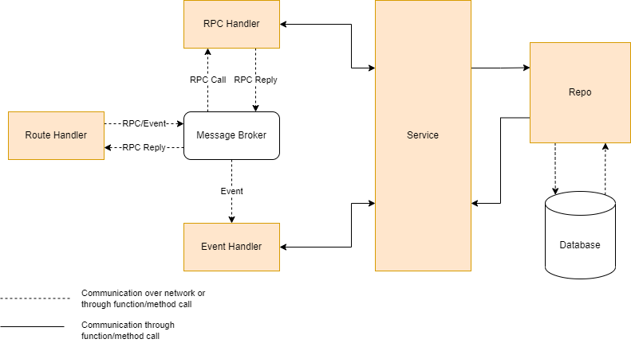

<!--startTocHeader-->
[🏠](../README.md) > [Motivation and architecture](README.md)
# Interface and layers
<!--endTocHeader-->

ZtplAppDirectory is organized in a layered architecture. Every layers are encapsulated, yet they can pass data to each other.

For example, a UI layer should not know about database layer's implementation, but it should be able to pass data into/receive data from it.

You can also swap a layer with another one as long as both layer has the same interface. For example, you can choose to use `LocalRPC` or `RMQRPC`. Both of them are compatible to each other, because they have the same interface: `RPC` interface.

# Available layers



## Route handler

This layer handle HTTP request from any client. It can return a HTML UI or an API response.
In most cases, route handler talk to RPC/event handler through message broker.

Route handler usually located on:

- `<module-name>/route.py`
- `<module-name>/<entity>Route.py`

You can use `LocalRPC` or `RMQRPC` seamlessly. LocalRPC doesn't take your data over the wire, thus it is ideal for development/single monolith deployment.

To switch between `LocalRPC` or `RMQRPC`, you can use `APP_RPC_TYPE` environment:

```bash
APP_RPC_TYPE=local # or rmq
```

Here is an example of route handler layer:

```python
def register_book_route(app: FastAPI, mb: MessageBus, rpc: RPC, auth_service: AuthService, menu_service: MenuService, templates: Jinja2Templates, enable_ui: bool, enable_api:bool):

    if enable_api:

        @app.get('/api/v1/books/', response_model=BookResult)
        def find_books(keyword: str='', limit: int=100, offset: int=0, current_user:  User = Depends(auth_service.is_authorized('api:book:read'))) -> BookResult:
            result = {}
            try:
                result = rpc.call('find_book', keyword, limit, offset)
            except:
                print(traceback.format_exc()) 
                raise HTTPException(status_code=500, detail='Internal Server Error')
            return BookResult.parse_obj(result)
```

This route handler handle `GET /api/v1/books` request.

To access the url, a user need `api:book:read` permission.

Once authorized, the handler will pass the keyword, limit, and offset into into `find_book` RPC handler.

Please note that RPC handler and event handler only accept/return primitive data, list, and dictionary. Thus, you need to call `BookResult.parse_obj(result)` to convert `result` into `BookResult` object.

## RPC handler

This layer handle RPC call from message broker. An RPC call usually expect a reply, so you have to make sure you give one.

RPC handler usually located on:

- `<module-name>/rpc.py`
- `<module-name>/<entity>Rpc.py`

Example:

```python

def register_book_rpc(rpc: RPC, book_repo: BookRepo):

    book_service = BookService(book_repo)

    @rpc.handle('find_book')
    def find_books(keyword: str, limit: int, offset: int) -> Mapping[str, Any]:
        book_result = book_service.find(keyword, limit, offset)
        return book_result.dict()
```

This handler handle `find_book` RPC call.

Once it get a RPC call, it will pass the `keyword`, `limit`, and `offset` into repo layer (i.e., `book_service.find(keyword, limit, offset)`).

Since RPC handler expect to send/receive data over the network, it can only accept/return primitive data type, list or dictionary. Thus, it needs to render `book_result` into dictionary by invoking `book_result.dict()`.

## Event handler

This layer handle event from message broker. An event usually doesn't expect any reply/response.

Like RPC handler, event handler only accept primitive data type as well as list and dictionary.

RPC handler usually located on:

- `<module-name>/event.py`

Example:

```python

def register_library_event_handler(mb: MessageBus):

    @mb.handle('open')
    def handle_open(message: Mapping[str, Any]):
        print('Event ope has been occured with message: {}'.format(message))
```

## Service

This layer handle your business logic. It is usually called by `RPC handler` or `Event handler`. When a service need to retrive something from/store something into database, it usually need to talk to `Repo` layer. For example:

```python

class BookService():

    def __init__(self, book_repo: BookRepo):
        self.book_repo = book_repo

    def find(self, keyword: str, limit: int, offset: int) -> BookResult:
        count = self.book_repo.count(keyword)
        rows = self.book_repo.find(keyword, limit, offset)
        return BookResult(count=count, rows=rows)
```


## Repo

This layer handle communication with database.

Repo layer usually located on:

- `<repos>/<entity>.py`
- `<repos>/db<Entity>.py`


Example:

```python

class DBBookRepo(BookRepo):

    def __init__(self, engine: Engine, create_all: bool):
        self.engine = engine
        if create_all:
            Base.metadata.create_all(bind=engine)

    def _get_keyword_filter(self, keyword: str) -> str:
        return '%{}%'.format(keyword) if keyword != '' else '%'

    def find(self, keyword: str, limit: int, offset: int) -> List[Book]:
        db = Session(self.engine)
        books: List[Book] = []
        try:
            keyword_filter = self._get_keyword_filter(keyword)
            db_books = db.query(DBBookEntity).filter(DBBookEntity.title.like(keyword_filter)).offset(offset).limit(limit).all()
            books = [Book.from_orm(db_result) for db_result in db_books]
        finally:
            db.close()
        return books

    def count(self, keyword: str) -> int:
        db = Session(self.engine)
        book_count = 0
        try:
            keyword_filter = self._get_keyword_filter(keyword)
            book_count = db.query(DBBookEntity).filter(DBBookEntity.title.like(keyword_filter)).count()
        finally:
            db.close()
        return book_count
```

# Interface

Interface is contract. It helps you define set of behaviors.

In Python, we can use `abstract base class` or `abc` instead of interface.

Using interface allows you to change the implementation by configuration.

For example, you have `DBBookRepo` and `MemBookRepo` that implement `BookRepo`:

```python

##############################################################################
# BookRepo interface
##############################################################################

class BookRepo(abc.ABC):

    @abc.abstractmethod
    def find(self, keyword: str, limit: int, offset: int) -> List[Book]:
        pass

    @abc.abstractmethod
    def count(self, keyword: str) -> int:
        pass


##############################################################################
# MemBookRepo implementation
##############################################################################

class MemBookRepo(BookRepo):

    def __init__(self):
        self._book_map: Mapping[str, Book] = {}

    def find(self, keyword: str, limit: int, offset: int) -> List[Book]:
        books: List[Book] = []
        # your implementation
        return books

    def count(self, keyword: str) -> List[Book]:
        book_count = 0
        # your implementation
        return book_count


##############################################################################
# DBBookRepo implementation
##############################################################################

class DBBookRepo(BookRepo):

    def __init__(self, engine: Engine, create_all: bool):
        self.engine = engine
        if create_all:
            Base.metadata.create_all(bind=engine)

    def _get_keyword_filter(self, keyword: str) -> str:
        return '%{}%'.format(keyword) if keyword != '' else '%'

    def find(self, keyword: str, limit: int, offset: int) -> List[Book]:
        db = Session(self.engine)
        books: List[Book] = []
        # your implementation
        return books

    def count(self, keyword: str) -> int:
        db = Session(self.engine)
        book_count = 0
        # your implementation
        return book_count

```

Next, you can define a service that depends on `BookRepo` interface instead of `MemBookRepo` or `DBBookRepo`:

```python
class MyService():
    def __init__(self, book_repo: BookRepo):
        self.book_repo: BookRepo = book_repo
```

Finally, you can create the service:

```python
def get_book_repo(app_storage: str) -> BookRepo:
    '''
    This function might return DBBookRepo or MemBookRepo. depends on app_storage value.
    '''
    if app_storage = 'db':
        db_url = os.getenv('APP_SQLALCHEMY_DATABASE_URL', 'sqlite:///database.db')
        engine = create_engine(db_url, echo=True)
        return DBBookRepo(engine=engine, create_all=True)
    return MemBookRepo()

app_storage =  os.getenv('APP_STORAGE', 'db')
book_repo = get_book_repo(app_storage)

my_service = MyService(book_repo)
```

Now you can set which repo is used by `my_ervice` without changing your codebase.

# Connecting layers

Next, you can continue to [connecting layers](connecting-layers.md).

<!--startTocSubTopic-->
<!--endTocSubTopic-->